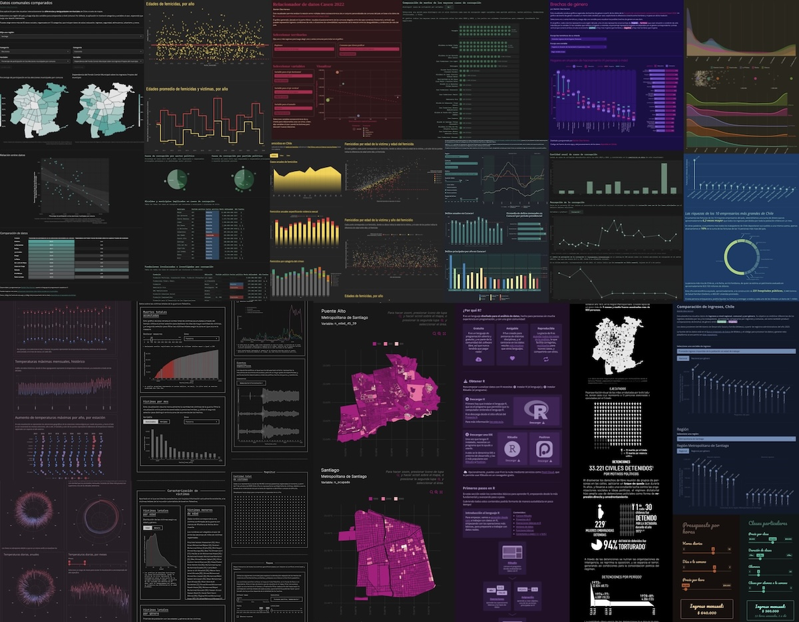

### Bastián Olea Herrera

Hola! 🌸

En este repositorio comparto proyectos personales de ciencia de datos 👩🏻‍🔬 particularmente acerca de obtener, procesar y visualizar **datos sociales** en el [lenguaje de programación estadística R](https://bastianolea.github.io/aprende_r/) 📊

Varios de estos repositorios son **aplicaciones web** desarrolladas en R y [Shiny](https://bastianolea.rbind.io/tags/shiny/), que permiten visualizar datos de forma interactiva. Puedes encontrarlas y explorarlas todas en mi [portafolio de visualizadores de datos sociales de Chile](https://bastianolea.github.io/shiny_apps/) 👩🏻‍💻

Cualquier duda o consulta que tengas sobre usar R para datos sociales es bienvenida y puedes hacérmela [por este formulario](https://bastianolea.rbind.io/contacto/) ☺️

Puedes encontrar más sobre mi en mi [sitio web personal.](https://bastianolea.rbind.io)

----

- [Sitio web sobre R con tutoriales, aplicaciones, guías y recursos para análisis de datos con R](https://bastianolea.rbind.io)

- [Portafolio de aplicaciones web de visualización de datos sociales](https://bastianolea.github.io/shiny_apps/)

- [Página con recursos para aprender R de forma autodidacta](https://bastianolea.github.io/aprende_r/)

