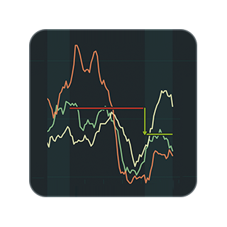
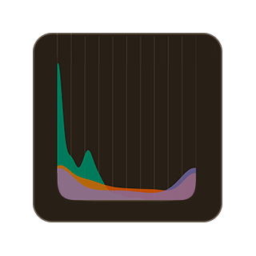

### Bastián Olea Herrera

Hola! 🌸

En este repositorio comparto proyectos personales de ciencia de datos 👩🏻‍🔬 particularmente acerca de descargar, procesar y visualizar **datos sociales** en el [lenguaje de programación estadística R](https://www.r-project.org) 📊

Varios de estos repositorios son **aplicaciones web** desarroladas en R y [Shiny](https://shiny.posit.co), que permiten visualizar datos de forma interactiva. Puedes encontrarlas y explorarlas todas en mi [portafolio de visualizadores de datos sociales de Chile](https://bastianolea.github.io/shiny_apps/) 👩🏻‍💻

Cualquier duda o consulta que tengas sobre usar R para datos sociales es bienvenida ☺️

Puedes encontrar más sobre mi, y mis datos de contacto, en mi [sitio web personal.](https://bastian.olea.biz)

## Aplicaciones web de datos sociales

### Visualizador de datos de delincuencia en Chile

### Visualizador de casos de corrupción en Chile

### Visualizador de datos sobre millonarios de Chile

### Visualizador de brechas de género en variables socioeconómicas a nivel regional en Chile

### Visualizador y relacionador de variables socioeconómicas de Chile

### Visualizador y comparador de ingresos de las comunas de Chile

