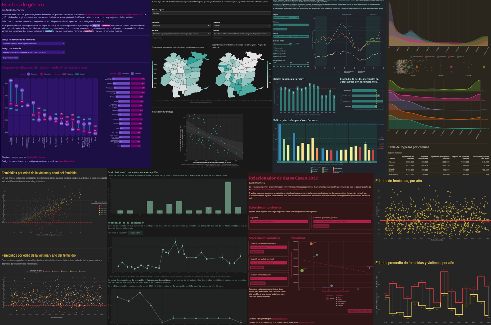

### Bastián Olea Herrera

 

Hola! 🌸

En este repositorio comparto proyectos personales de ciencia de datos 👩🏻‍🔬 particularmente acerca de descargar, procesar y visualizar **datos sociales** en el [lenguaje de programación estadística R](https://www.r-project.org) 📊

Varios de estos repositorios son **aplicaciones web** desarroladas en R y [Shiny](https://shiny.posit.co), que permiten visualizar datos de forma interactiva. Puedes encontrarlas y explorarlas todas en mi [portafolio de visualizadores de datos sociales de Chile](https://bastianolea.github.io/shiny_apps/) 👩🏻‍💻

Cualquier duda o consulta que tengas sobre usar R para datos sociales es bienvenida ☺️

Puedes encontrar más sobre mi, y mis datos de contacto, en mi [sitio web personal.](https://bastian.olea.biz) Cualquier consulta puedes [escribirme a mi correo](mailto:bastianolea@gmail.com)

## Aplicaciones web interactivas de datos sociales

**[Portafolio de aplicaciones web de visualización de datos sociales](https://bastianolea.github.io/shiny_apps/)**

[Análisis de texto de prensa escrita en Chile](https://bastianoleah.shinyapps.io/prensa_chile/)

[Dashboard de indicadores económicos principales de Chile](https://bastianoleah.shinyapps.io/economia_chile)

[Mapas comunales para comparación interactiva de datos sociales de Chile](https://bastianoleah.shinyapps.io/comparador_mapas_chile)

[Visualizador de datos de delincuencia en Chile](https://bastianoleah.shinyapps.io/delincuencia_chile/)

[Visualizador de casos de corrupción en Chile](https://bastianoleah.shinyapps.io/corrupcion_chile/)

[Visualizador de datos sobre la riqueza de empresarios millonarios de Chile](https://bastianoleah.shinyapps.io/millonarios_chile/)

[Visualizador de brechas de género en variables socioeconómicas a nivel regional en Chile](https://bastianoleah.shinyapps.io/casen_brechas_genero/)

[Visualizador y relacionador de variables socioeconómicas de Chile](https://bastianoleah.shinyapps.io/casen_relacionador/)

[Visualizador y comparador de ingresos de las comunas de Chile](https://bastianoleah.shinyapps.io/casen_comparador_ingresos/)

[Visualizador de proyecciones de población del Censo de Chile, desde 2002 hasta 2035](https://bastianoleah.shinyapps.io/censo_proyecciones/)

